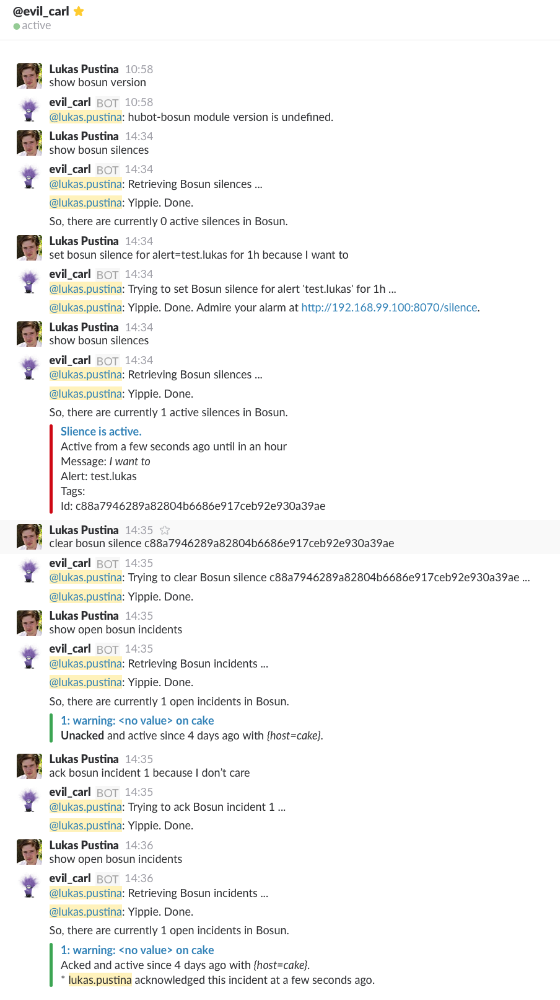

# hubot-bosun

[](https://travis-ci.org/lukaspustina/hubot-bosun)

[](https://nodei.co/npm/hubot-bosun/)

Allows [Hubot](https://hubot.github.com) to interact with [Bosun](http://bosun.org).

See [`src/bosun.coffee`](src/bosun.coffee) for full documentation.

## Installation

In hubot project repo, run:

`npm install hubot-bosun --save`

Then add **hubot-bosun** to your `external-scripts.json`:

```json
[
  "hubot-bosun"
]
```

## Configuration

**hubot-bosun** may be used with [hubot-auth](https://github.com/hubot-scripts/hubot-auth) and configure via the following environment variables:

* `HUBOT_BOSUN_HOST="http://192.168.99.100:8070"` Bosun server URL
* `HUBOT_BOSUN_LINK_URL="http://example.com:8070"` If set, this URL will be used for links instead of `HUBOT_BOSUN_HOST`
* `HUBOT_BOSUN_ROLE="bosun"` If set, auth role required to interact with Bosun
* `HUBOT_BOSUN_SLACK="yes"` If yes, use rich formatting for slack
* `HUBOT_BOSUN_LOG_LEVEL="info"` Log level; defaults to `info`
* `HUBOT_BOSUN_TIMEOUT="10000"` Timeout for Bosun API calls; default to 10.000 ms
* `HUBOT_BOSUN_RELATIVE_TIME="yes"` If yes, use relative timestamps like "2 min ago"

## Commands

### Incidents

* `show open bosun incidents` shows all open incidents, unacked and acked, sorted by incident id
* `<ack|close> bosun incident[s] <Id,...> because <message>` acks or closes bosun incidents with the specific incident ids

### Silences

* `show bosun silences` shows all active silences
* `<set|test> bosun silence for [alert=<alert name>,[tag=value,...]] for <duration> because <message>` sets or tests a new silence, e.g., set bosun silence for alert=test.lukas,host=muffin for 1h because I want to. Can also be used with alert or tags only.
* `clear bosun silence <id>` deletes silence with the specific silence id


## Sample Interaction

### Plain

```
Lukas Pustina> list open bosun incidents

hubot> @lukas.pustina: Retrieving Bosun incidents ...

hubot> @lukas.pustina: Yippie. Done.
 So, there are currently 2 open incidents in Bosun.
 4: critical: <no value> on muffin
 Acked and active since 2 hours with {host=muffin}.
 lukas.pustina acknowledged this incident at a few seconds ago.
 5: warning: <no value> on cake
 Acked and active since 3 hours with {host=cake}.
 lukas.pustina acknowledged this incident at a few seconds ago.

Lukas Pustina> close bosun incidents 4,5 because Everything is fine again.

hubot> @lukas.pustina: Trying to close Bosun incidents 4,5 ...

hubut> @lukas.pustina: Yippie. Done.

Lukas Pustina> list open bosun incidents

hubot> @lukas.pustina: Retrieving Bosun incidents ...

hubot> @lukas.pustina: Yippie. Done.
 Oh, no incidents there. Everything is ok.
```

### Slack



## NPM Module

https://www.npmjs.com/package/hubot-bosun
